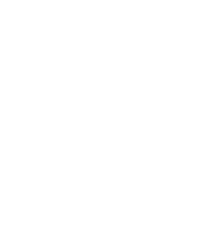

<p align="center">
<br/>
<a href="https://github.com/nix-how/nix.ug">
  
</a>
</p>

<h1 align="center">nix.ug</h1>

A friendly and static way to catalogue all of the Nix User Groups in existence,
by using Nix, Git and Yaml.

## Adding a new user group or event to the list

1. Create a new `default.nix` in a folder in [`./lists/NUGs/`](./lists/NUGs) or
   [`./lists/Events/`](./lists/Events) that follows this template:

   ```nix
   {
     keywords = ""; # space separated keywords
     name = "My User Group";
     subtitle =  "Every Thursday at Eelco's";
     tag = "Netherlands";
     target = "_blank"; # optional html <a> tag target attribute
     url = "https://nug.nixos.org";
   }
   ```

2. Populate it with your details
3. Optionally place an image file named `logo`, such as `logo.svg` or `logo.png`
   with any extension in the same directory
4. Submit a PR

